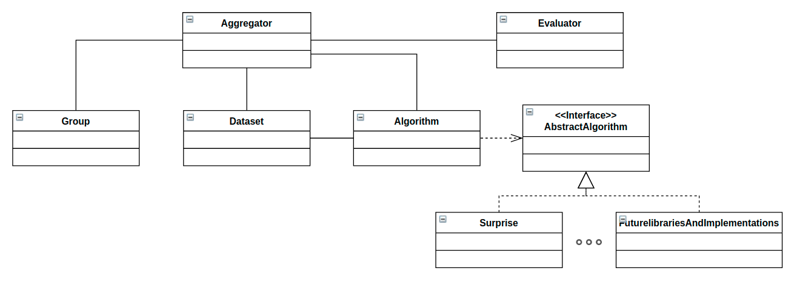

# Collaborative Filtering Group Recommender System
A context-aware group recommender system based on collaborative filtering, with benchmarking experiments.

It has been tested in the music domain (song recommendation), both by performing experiments (section 2) and in the implementation of a web application (using flask_backend.py together with firebase).

During the development of this *recommender system/benchmark*, an own dataset has been created and will be published soon. For more information see section 4.


# 1. Execution
Download and dependencies installation:
```bash
git clone https://github.com/adrixo/cf-group-recommender-system
cd cf-group-recommender-system
pip install -r requirements.txt
```
Execution of a simple recomendation:
```bash
cd recommender
python3 recommender_example.py
```
Execution of automated experiments (may require high computational cost with large datasets):
```bash
cd recommender
python3 experiments.py
```

## Automated experiments and results

The following experiment is proposed to test the results of the recommendations with different configurations:

1. For each context in [none, chill, fitness, party]
2. For each algorithm in [baseline, svd, coclustering, nmf, knn]
3. For each group in [custom groups]
4. For each aggregation method in [avg, add, app, avm, lms, maj, mpl, mul]
5. For each top-n length from 5 to 100
-> Calculation of precision, recall and nDCG metrics.

This experiment is described in recommender-system/experiments.py

Where the contexts are induced from Spotify songs' features:

- **Chill:** Song's energy below 30%
- **Party:** Song's valence over 85%
- **Fitness:** Song's energy over 90%

After the execution, the *recommender-system/results_file.csv* is created and can be processed throught *recommender-system/process_results.ipynb* to create result graphs:

<table>
  <tr>
    <td> </td>
    <td></td>
   </tr> 
   <tr>
      <td></td>
      <td></td>
  </tr>
</table>

# 2. Context-aware group recomendation 

The recommender system is based on aggregated predictions. The predictions are obtained using the collaborative filtering approach and then aggregated through one of the 9 implemented aggregation methods. The context is considered through the pre-filtering strategy. Finally, the evaluation is performed on top-n lists according to the relevant items recommended for the different group members.

The following figure shows the recommendation process:


## Recommender structure

The recommender consists of five classes, each one related to the steps that involve the recommendation, except for the contextual pre-filtering that is performed during the dataset loading for better performance. The classes are connected as follows:



The "algorithm" class uses the [facade design pattern](https://en.wikipedia.org/wiki/Facade_pattern) in order to, using the algorithm_base.py interface, different libraries or implementations can be used. In the **Algorithms** subsection this interface is detailed. 

The following example shows the simplified execution of objects:

###### recommender_example.py
```python
# 1. Dataset load + contextual prefiltering
ds = Dataset(
    dataset_file, sep=sep, cols=columns,
    rating_scale=rating_scale, split_dataset=True,
    lib=lib, line_format=line_format)

# 2. Model load and model fitting
alg = Algorithm(ds, lib, algorithm)
alg.fit_model()

# 3. Group creation
group = Group(group_name='group name')
group.add_list_of_users(custom_group_members)

# 4. Aggregation of group recommendation prediction
agg = Aggregator(ds, alg, group)
rec = agg.perform_group_recommendation()
agg.print_group_recommendation()

# 5. Group recommendation evaluation
agg.evaluate()

```


#### Algorithms

Six algorithms have been implemented using the [Surprise library (github project)](https://github.com/NicolasHug/Surprise), for more information about it and more details about each algorithm see the [Surprise documentation](https://surprise.readthedocs.io/en/stable/).

**1. Surprise:**
&nbsp;&nbsp;&nbsp;- Baseline
&nbsp;&nbsp;&nbsp;- SVD
&nbsp;&nbsp;&nbsp;- KNN
&nbsp;&nbsp;&nbsp;- CoClustering
&nbsp;&nbsp;&nbsp;- NMF
&nbsp;&nbsp;&nbsp;- SlopeOne

**2. Other libraries/implementations:**
&nbsp;&nbsp;&nbsp;- To implement *

\* Any other library or developer implementation can be developed following the algorithm_base.py interface, fulfilling the following methods:
```
start_model()
fit()
predict()
get_top_n()
```

#### Agregation methods
9 aggregation methods have been implemented from [Felfering et al.](https://www.springer.com/gp/book/9783319750668), divided into three groups:

**1. Consensus based:**
&nbsp;&nbsp;&nbsp;- Average
&nbsp;&nbsp;&nbsp;- Additive utilitarian
&nbsp;&nbsp;&nbsp;- Multiplicative
&nbsp;&nbsp;&nbsp;- Average without misery
&nbsp;&nbsp;&nbsp;- ~~fairness~~
**2. Borderline based:**
&nbsp;&nbsp;&nbsp;- Least misery
&nbsp;&nbsp;&nbsp;- Majority voting
&nbsp;&nbsp;&nbsp;- Most pleasure
&nbsp;&nbsp;&nbsp;- ~~Most respected person~~
**3. Majority based:**
&nbsp;&nbsp;&nbsp;- Approval voting
&nbsp;&nbsp;&nbsp;- Plurality voting 
&nbsp;&nbsp;&nbsp;- ~~Copeland rule~~
&nbsp;&nbsp;&nbsp;- ~~Borda count~~

#### Contextual pre-filtering
contextual pre-filtering is performed during dataset loading using lists with tuples in the following way:
```json
[
    {"name": "context_name"
        "context": [{
            "column": "column_1",
            "mode": "value",
            "threshold": 0.85,
            "direction": "above"
        }]
    },
    {"name":"context_2", "context": ...}
]
```
Where column is the selected column to filter, mode is 'value' or 'nominal' if the filtered variable is a number or a tag, and direction (above or below) is the threshold direction to filter.

#### Evaluation metrics:

The evaluation metrics are based on the analysis of top-n recommended lists, based on whether or not the ratings of the recommended are relevant (above or below a certain threshold). 

The currently implemented functions are:
&nbsp;&nbsp;&nbsp;- **Precision**
&nbsp;&nbsp;&nbsp;- **Recall**
&nbsp;&nbsp;&nbsp;- **DCG and nDCG**
&nbsp;&nbsp;&nbsp;- ~~MAE and RSME~~

The MAE, RSME metrics are not valid in aggregate prediction, its implementation is limited to the study of its performance .
Serendipity, coverage, consensus and fairness implementation could be studied in future works.

The evaluation of top-n lists is strongly influenced by their length (n-value).

# 3. Configuration file and other scripts

In order to simplify the executions and experiments, the file configuration.py is created, in that file the dataset used and its information, the group details, algorithms employed, etc. are set.


### Additional scripts (Dataset reduction, experiments visualization...)
Several scripts have been created to automate experiments and data processing:
En la carpeta preproc data hay distintos archivos con los cuales generar y procesark los archivos

# 4. Proposed dataset

The dataset has been created from the [LastFm 1k users dataset](http://ocelma.net/MusicRecommendationDataset/lastfm-1K.html) and enriched with spotify song features using the [spotify API](https://developer.spotify.com/documentation/web-api/).


This dataset will be published soon.

# 5. License 
